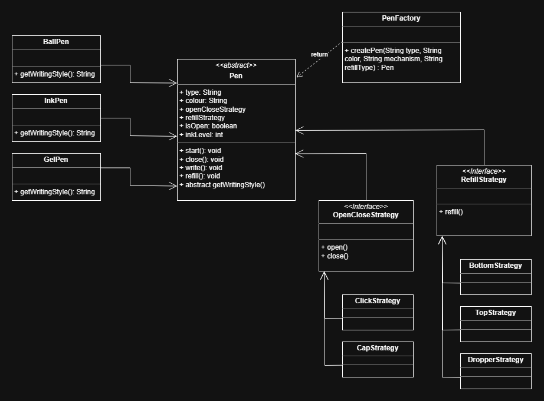

# Pen System Design (LLD)

A simple Low-Level Design (LLD) to model different types of pens using **object-oriented design principles**.

## Features

* Supports multiple pen types:

  * Gel Pen
  * Ball Pen
  * Ink Pen

* Supports different opening mechanisms:

  * Click-based
  * Cap-based

* Supports multiple refill mechanisms:

  * Top refill
  * Bottom refill
  * Dropper refill

## UML Diagram

## Design Overview

### 1. Pen (Abstract Class)

The core class that represents a pen.

It handles:

* Ink level management
* Open/close state
* Writing logic
* Delegates behavior to strategies

Each specific pen type (Gel, Ball, Ink) extends this class and defines its own writing style.

### 2. Strategy Pattern

Instead of hardcoding behavior, we use strategies to make the system flexible.

#### Open/Close Strategy

Defines how a pen is opened or closed:

* `ClickStrategy`
* `CapStrategy`

#### Refill Strategy

Defines how a pen is refilled:

* `TopRefillStrategy`
* `BottomRefillStrategy`
* `DropperRefillStrategy`

### 3. Factory Pattern

The `PenFactory` is responsible for creating pen objects.

Instead of manually instantiating objects everywhere, the factory:

* Chooses the correct pen type
* Assigns the right strategies

This keeps object creation clean and centralized.

## Key Design Decisions

* **Used Strategy Pattern** to handle behaviors that can change (open/close, refill)
* **Used Factory Pattern** to centralize object creation
